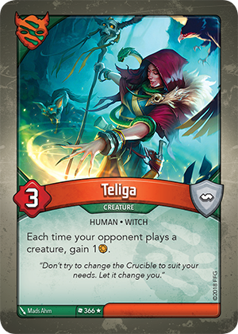

# Keyforge-Downloader

### Project Summary
Tool to download PNG image files of cards from all printed sets.

### Download Instructions
1.  In a code editor of your choice, open the file **downloader.py**.  DO NOT double-click on the file or it will run the script.
2. On row 8, select the languages of cards that you would like to download.  Example:  If you wish to only download English version cards, remove the object "{"code": "de-de", "folder": "de/"}" and the preceeding comma.  
3.  Double click to run the file **downloader.py**.
4.  Once the script has run, you will have a new folder *images* that will hold the image files for all cards.

